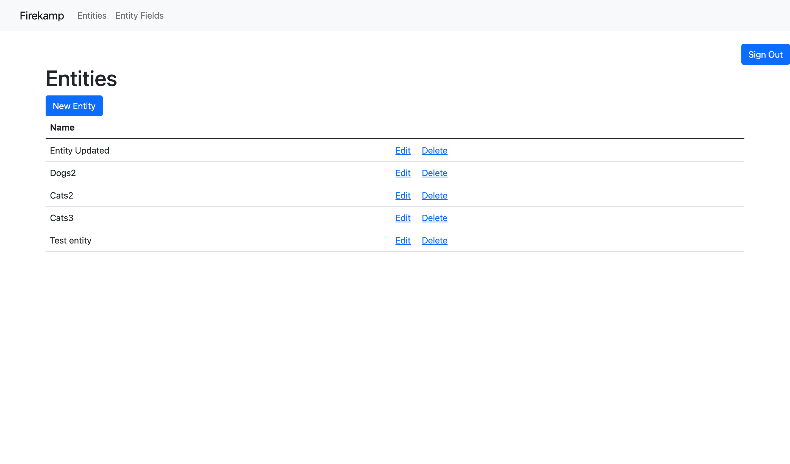

# How to run

- rails db:create
- rails db:migrate
- rails db:seed
- rails s
- To test CMS make sure `firekamp-web`  is running on a different port (eg localhost:3001)

API Documentation: https://documenter.getpostman.com/view/13242814/2sA3Bn7YHx

# What was made

# Libraries Used
### **Authentication**
- **devise**: Standard user auth library to streamline authentication workflow
- **devise_auth_token**: Library that allows auth tokens to be used with devise models. Enables client consumers to manage auth credentials with the API.

# Later
- More tests
- Add a concept of of entity relationships. This will mimic ActiveRecord's has_many, has_one, and belongs_to and apply it to entities. 
- Token expiry/refresh logic
- Better searching for `entity-web` endpoints,
